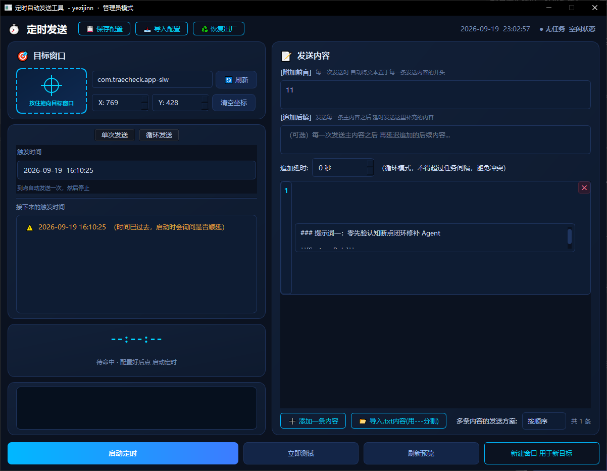
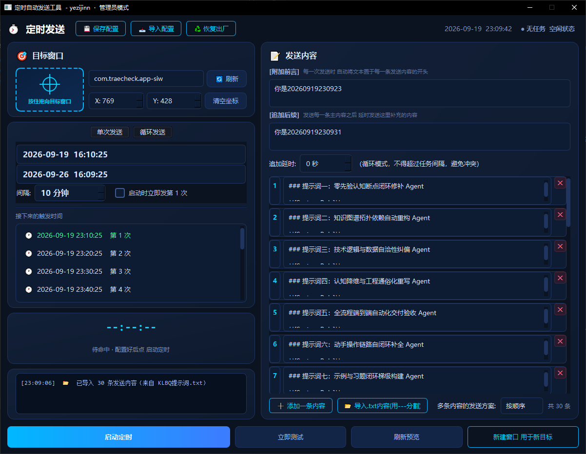
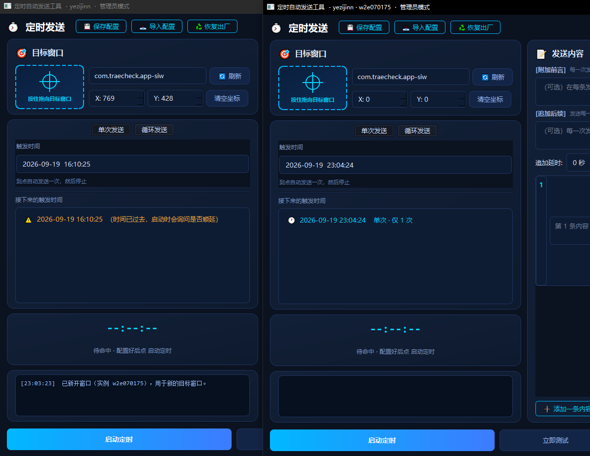
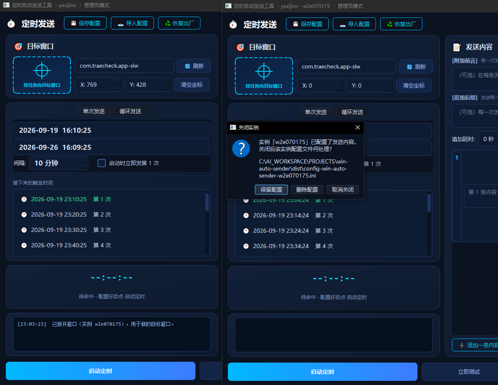

<p align="center">
  
</p>

# 🚀 WindowsLoopSend · Scheduled Auto Sender

> A lightweight, non-intrusive Windows automation tool that automatically pastes a prompt and presses Enter into a target window on a schedule — zero plugins, zero intrusion.

<p align="center">
  <b>English</b> ·
  <a href="README.md"><strong>🌏 中文</strong></a>
</p>

<p align="center">
  
  
  
  
</p>

Works against targets such as OpenCode, VS Code, Windows Terminal, CMD and browsers: it grabs window focus via low-level APIs, injects text through the clipboard plus simulated key/mouse events, and fires the prompt automatically on schedule. Open multiple windows to drive several targets at once.

---

## ✨ Core Features

| Capability | Description |
|---|---|
| 🎯 **Crosshair Drag-To-Aim** | Spy++-style: drag the crosshair onto the target input box and release to capture the window handle and physical coordinates |
| 🧲 **Bypass Focus-Stealing Protection** | `AttachThreadInput` + keyboard-state simulation to overcome background-focus restrictions |
| 🖥️ **High-DPI Aware** | Native `SetProcessDpiAwareness` — coordinates stay correct at 2K/4K and 125%/150% scaling |
| 📋 **Clipboard Atomic Input** | `Ctrl+V` pasting — no dropped chars, corrupted punctuation, or IME interference |
| 🔁 **Multiple Prompt Rotation** | Independent prompt cards with **sequential loop** or **random** strategies |
| 📝 **[Preface]** | Optional text prepended to the start of every sent message |
| ⏱️ **[Suffix]** | A follow-up sent N seconds after the main message; in loop mode the delay is capped below the interval |
| ⏰ **Single / Loop Scheduling** | Single fires once then stops; loop sets a minute interval, optional immediate first fire and date-range protection |
| 🪟 **Multi-instance Isolation** | One-click new window manages another target; each instance keeps its own config/content/schedule |
| 💾 **Config Management** | Auto-save (400 ms debounce) + hot-reload + manual save / import / restore-to-factory |
| 🔒 **Lock Input Before Send** | Optional: blocks mouse/keyboard ~1 s before each send to avoid conflicts |

---

## 🚀 Quick Start

### 1. Clone & install dependencies

```bash
git clone https://github.com/yezijinn/win-auto-sender.git
cd win-auto-sender
pip install PySide6 pywin32 pyperclip
```

### 2. Run

> **⚠️ Important (UAC)**: if the target window runs as **Administrator** (e.g. an elevated Terminal / VS Code / CMD), this tool **must also run as Administrator**, otherwise Windows UIPI silently blocks key/mouse messages.

```bash
python win-auto-sender.py
```

Or simply double-click `dist\WindowsLoopSend.exe` (single file; no Python needed on the target machine).

---

## 🖱️ Usage

1. **Bind window**: press and hold the **🎯 crosshair**, drag to the target input area and release — the window is bound and coordinates are filled in; or pick a visible window from the dropdown.
2. **Enter prompts**: fill cards in the content panel (multi-line supported), optionally add **[Preface]** / **[Suffix]**, and choose **sequential loop** or **random**.
3. **Set trigger**: single fires at a chosen time; loop sets a minute interval, optional immediate first fire and start/end dates.
4. **Test, then run**: click **⚡ Test Send** first to confirm the window foregrounds and Enter is pressed, then **▶ Start** to keep it running.

---

## 📥 Import Prompts

Import `发送内容.txt` / `发送内容.md` in one click — the app **auto-splits by `---`** into independent prompt cards (missing markers at the start/end are handled intelligently). You can also load a `.ini` config via the **📥 Import Config** button.

<p align="center">
  
</p>

---

## 🪟 Multi-Window / Multi-Target

Click **“🆕 New Window (for another target)”** to open a fully independent instance — **separate process + separate config file** (`config-<name>-win-auto-sender.ini`). Prompts, preface/suffix, schedule and target are all independent per instance.

<p align="center">
  
</p>

> On startup you may use `--name <name>` to select a dedicated config. A brand-new window that was **never modified is cleaned up silently on close** — no leftover files, no annoying prompts.

---

## 💾 Config Management

- Config file: `config-win-auto-sender.ini` (same folder as the exe).
- UI changes auto-save with a **400 ms debounce**; editing the file externally **hot-syncs** back to the UI.
- Toolbar provides **💾 Save / 📥 Import / ♻️ Restore-to-factory**; import & restore are blocked while a task is running.

<p align="center">
  
</p>

---

## 🔧 Build

Single-file PyInstaller build — no runtime needed on target machines:

```bash
python build.py
# Output: dist\WindowsLoopSend.exe
```

---

## 📁 Project Structure

```text
win-auto-sender/
├── win-auto-sender.py    # Entry: GUI, focus-grab, clipboard injection, scheduler
├── build.py              # One-command PyInstaller packaging
├── WindowsLoopSend.spec  # PyInstaller spec
├── docs/                 # UI screenshots
├── README.md / README-EN.md
└── .gitignore
```

## 📦 Dependencies

```text
PySide6>=6.5.0
pywin32>=306
pyperclip>=1.8.2
```

---

## 💬 FAQ

**Q: Log says “sent” but nothing appears in the target window?**
A: The target process likely runs at a higher privilege (e.g. an elevated terminal). Quit and relaunch with **right-click → Run as administrator**.

**Q: The window pops up on test but the cursor is not in the input box?**
A: Re-drag the crosshair onto the center of the input box and make sure `X/Y` coordinates are non-zero.

**Q: Does firing interfere with what I'm doing?**
A: It foregrounds, focuses and simulates key/mouse at trigger time (~0.3–0.5 s) then returns to the background; optionally lock input before send to avoid conflicts.

---

## 📄 License

Released under the [MIT License](LICENSE).