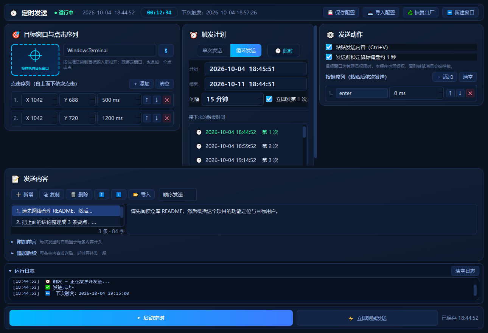
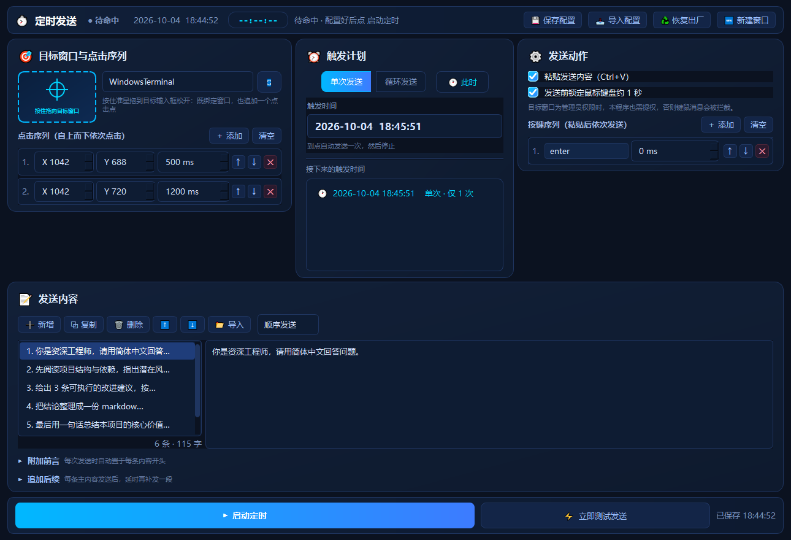
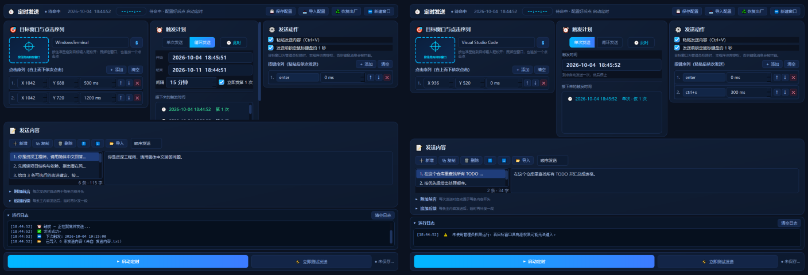
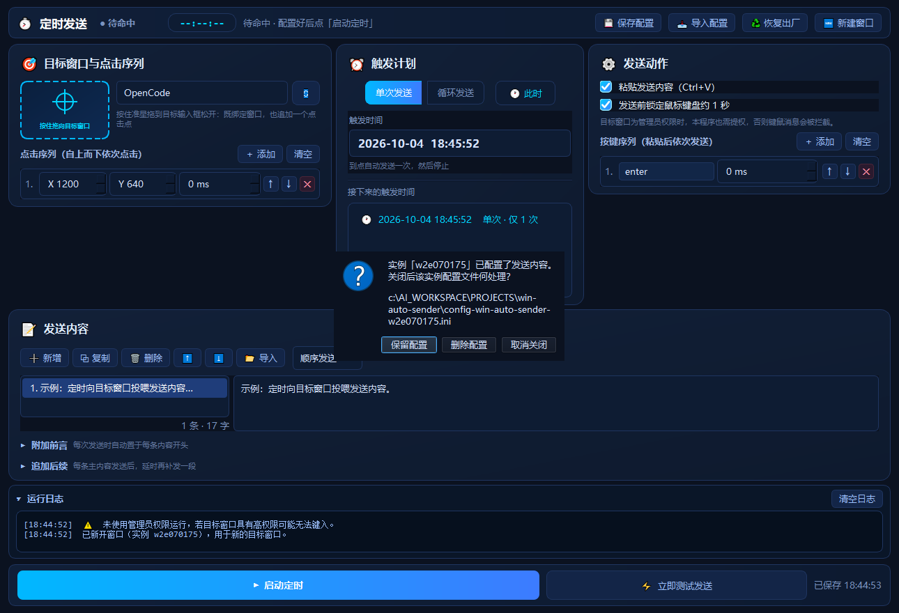

<p align="center">
  
</p>

# 🚀 WindowsLoopSend · 定时指令自动发送工具

> 轻量、无侵入的 Windows 自动化工具 —— 定时把提示词自动粘贴并回车发送到指定窗口，全程零插件、零侵入。

<p align="center">
  <a href="README-EN.md"><strong>🌍 English</strong></a> ·
  <b>中文</b>
</p>

<p align="center">
  
  
  
  
</p>

面对 OpenCode、VS Code、Windows Terminal、CMD、浏览器等目标，本工具通过底层 API 抢占窗口焦点，配合剪贴板注入与键鼠事件模拟，实现**定时自动发送**，也能开多个窗口同时管理多个目标。

---

## ✨ 核心特性

| 能力 | 说明 |
|---|---|
| 🎯 **准星拖拽瞄准** | Spy++ 风格：按住准星拖到目标输入框松开，自动绑定窗口并把该坐标追加为点击序列的一步 |
| 🖱️ **点击序列** | 一个目标可配多个点击点依次执行：坐标自定义（支持副屏负坐标）、顺序可调（拖动/↑↓）、**每步独立间隔**（ms） |
| ⌨️ **按键序列** | 粘贴后依次按键：`Enter` / `Tab` / `Esc` / `F1`~`F12` / `Ctrl+A` 等单键与组合键，**每步独立间隔** |
| 📋 **粘贴开关** | 可关闭 `Ctrl+V` 粘贴，只发送按键（例如仅做快捷键操作） |
| 🧲 **突破抢焦点拦截** | `AttachThreadInput` + 键盘状态模拟，穿透 Windows 防后台偷焦限制 |
| 🖥️ **高分屏 DPI 自适应** | 原生 `SetProcessDpiAwareness`，2K/4K 与 125%/150% 缩放坐标不偏移 |
| 📋 **剪贴板原子输入** | `Ctrl+V` 粘贴，告别长文本丢字、标点乱码与输入法拦截 |
| 🗂️ **内容工作台（主从式）** | 左侧内容列表 + 右侧编辑器：新增 / 复制 / 删除 / 拖动排序，**列表顺序即发送顺序**，一键导入 `.txt/.md` |
| 🔁 **多提示词轮转** | 支持**顺序循环**与**纯随机**两种发送策略 |
| 📝 **[附加前言]** | 折叠区可选文本，合并到每条发送内容的开头 |
| ⏱️ **[追加后续]** | 折叠区可选文本，主内容触发后延时 N 秒再发一段，循环模式自动限制不超间隔 |
| ⏰ **单次 / 循环调度** | 单次指定时间发一次即停；循环设间隔分钟、可立即首发、可限定起止日期，并实时预览接下来的触发时刻 |
| 🧩 **三列设置区** | 目标与点击序列 / 触发计划 / 发送动作三列并排，一屏看全不用滚动；发送内容与运行日志在下方占满整宽，窗口尺寸与三列宽度自动记忆 |
| 🪟 **多实例隔离** | 一键新开独立窗口管理另一个目标，各自配置/内容/定时互不影响 |
| 💾 **配置管理** | 自动保存(400ms 防抖) + 热更新 + 手动保存/导入/恢复出厂，底部实时显示保存状态 |
| 🔒 **发送前锁键鼠** | 「发送行为」开关：发送前约 1 秒锁定鼠标键盘，避免与手动操作冲突（需管理员权限，未提权自动跳过） |

---

## 🚀 快速上手

### 1. 克隆并安装依赖

```bash
git clone https://github.com/yezijinn/win-auto-sender.git
cd win-auto-sender
pip install PySide6 pywin32 pyperclip
```

### 2. 运行

> **⚠️ 重要（UAC 权限）**：若目标窗口以**管理员身份**运行（如管理员版 Terminal / VS Code / CMD），本工具**必须同样以管理员运行**，否则 Windows UIPI 会静默拦截键鼠消息。

```bash
python win-auto-sender.py
```

或直接双击 `dist\WindowsLoopSend.exe`（单文件，目标机无需装 Python）。

---

## 🖱️ 界面布局

```text
┌─ 工具栏：状态 · 当前时间 · 倒计时 · 保存/导入/恢复出厂/新建窗口 ────────────────────────┐
│ ┌─ 🎯 目标窗口与点击序列 ─┐ ┌─ ⏰ 触发计划 ────────┐ ┌─ ⚙️ 发送动作 ──────────┐ │
│ │ 准星 · 窗口下拉 · 刷新   │ │ 单次 / 循环          │ │ 粘贴开关 · 锁键鼠       │ │
│ │ 点击序列：多点 · 顺序    │ │ 开始 / 结束 / 间隔   │ │ 按键序列：单键与组合键  │ │
│ │ 每步独立间隔（ms）       │ │ 立即首发 · 触发预览  │ │ 每步独立间隔（ms）      │ │
│ └─────────────────────────┘ └─────────────────────┘ └────────────────────────┘ │
│ ┌─ 📝 发送内容（全宽）────────────────────────────────────────────────────────┐ │
│ │ 工具条：新增/复制/删除/上下移/导入 + 发送方案 ｜ 列表 ｜ 编辑器 ｜ 附加前言/后续  │ │
│ └────────────────────────────────────────────────────────────────────────────┘ │
│ ▾ 运行日志（可折叠）                                                            │
│ 操作栏：[▶ 启动定时] [⚡ 立即测试发送]                                   保存状态提示  │
└──────────────────────────────────────────────────────────────────────────────┘
```

设置区三列并排（列宽可拖拽、各列内部可滚动），发送内容与运行日志在下方占满整宽；窗口尺寸、三列宽度与各段高度均自动记忆。

## 🖱️ 使用步骤

1. **绑定窗口与点击点**：按住设置区 **🎯 准星** 拖到目标输入框松开，即绑定窗口并把该坐标**追加**为点击序列的一步；需要在多个位置点击（输入框→发送按钮）就多拖几次，之后用 **↑/↓** 调整执行顺序、修改每步的 **间隔(ms)**。一个点击点都不加，则只聚焦窗口不点击。
2. **填发送内容**：在「发送内容」区点 **➕ 新增** 加一条，选中后在编辑区书写（可多行）；**⬆/⬇ 或直接拖动条目**调整顺序；可选填 **[附加前言]** / **[追加后续]**。
3. **设触发**：单次填时间；循环填间隔分钟、可勾选立即首发、可设起止日期，下方即时预览接下来的触发时刻。
4. **配发送行为**：决定是否 **粘贴发送内容（Ctrl+V）**，并编辑 **按键序列**——默认一条 `Enter`，可换成 `Tab`、`F5`、`Ctrl+A` 等单键或组合键，每步可设独立间隔。
5. **测试再挂机**：先点 **⚡ 立即测试发送** 确认能聚焦、点击、粘贴并按键，再点 **▶ 启动定时** 挂机。

---

## 📥 导入发送内容

在内容工作台点 **📂 导入**，一键导入 `发送内容.txt` / `发送内容.md`，程序会**按 `---` 自动分割**成多条独立内容（开头/末尾缺 `---` 也能智能识别），导入后可在列表中逐条编辑、排序；也可通过工具栏 **📥 导入配置** 载入 `.ini` 配置。

<p align="center">
  
</p>

---

## 🪟 多窗口 / 多目标

点击工具栏 **「🆕 新建窗口」** 即可新开一个完全独立的程序实例——**独立进程 + 独立配置文件**（`config-<实例名>-win-auto-sender.ini`），发送内容、前言/后续、定时、目标窗口全部独立，互不干扰。

<p align="center">
  
</p>

> 启动时也可用 `--name <实例名>` 指定专属配置；**未作任何修改的新建窗口关闭时自动回收清理配置**，不留垃圾文件。

---

## 💾 配置管理

- 配置文件：`config-win-auto-sender.ini`（与 exe 同级）。
- UI 修改自动保存（**400ms 防抖**）；外部改文件会**热更新**回 UI；底部状态提示实时显示「未保存 / 已保存 时间」。
- 工具栏提供 **💾 保存配置 / 📥 导入配置 / ♻️ 恢复出厂**；导入与恢复在任务运行中会被拦截。
- 窗口尺寸、各段高度与日志展开状态单独记忆（不写入 ini，不污染配置）。

<p align="center">
  
</p>

---

## 🔧 构建打包

PyInstaller 单文件打包，目标机无需任何运行库：

```bash
python build.py
# 产物：dist\WindowsLoopSend.exe
```

---

## 📁 项目结构

```text
win-auto-sender/
├── win-auto-sender.py    # 入口：GUI、抢焦点、剪贴板注入、后台调度
├── build.py              # 一键 PyInstaller 打包
├── WindowsLoopSend.spec  # PyInstaller 配置
├── docs/                 # 界面截图
├── LICENSE               # GPL-3.0 全文
├── BUG.md                # 缺陷清单与修复建议
├── README.md / README-EN.md
└── .gitignore
```

## 📦 依赖

```text
PySide6>=6.5.0
pywin32>=306
pyperclip>=1.8.2
```

---

## 💬 FAQ

**Q：日志显示“已发送”但目标窗口没内容？**
A：目标进程权限更高（如管理员终端）。退出后用**右键 → 以管理员身份运行**重启。

**Q：测试时窗口弹出但光标不在输入框？**
A：用准星重新拖到输入框中心松开，确保 `X/Y` 坐标非 0。

**Q：触发会干扰我当前操作吗？**
A：触发瞬间会拉前台取焦并模拟键鼠（约 0.3~0.5 秒），随后恢复后台；可开启发送前锁键鼠避免冲突。

---

## 📄 开源协议

本项目采用 [GPL-3.0](LICENSE) 开源：强 Copyleft，衍生作品需同样以 GPL 开源。